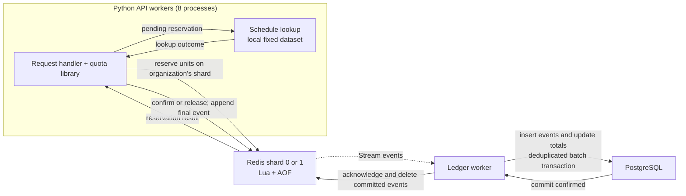

# Design

## Integration and shared state

The quota component is a Python library used inside each API process. A separate
quota service would add another network hop and another service to operate;
the shared Redis state already coordinates the eight application workers.
The consumer only calls `reserve`, `settle` and `usage`.

The deployment uses two Redis shards. `crc32(org_id) % shard_count` gives each
organization one owner, including all its features and retry receipts. Redis
stores a routing identity; startup refuses a changed count or reordered existing
shards. This is static partitioning, with no live rebalancing.

Quota Lua scripts execute atomically and are serialized within each Redis
process. Two shards allow quota operations for organizations assigned to
different shards to execute in parallel. This layout passed the full consumer's
10k requests/sec test below. It adds routing and migration complexity. The shards
own different data and provide no replication.

Redis holds the authoritative balance and operation receipts. PostgreSQL is an
asynchronous ledger for reporting and audit. The usage endpoint reads Redis,
so a slow ledger cannot cause stale quota decisions.

Balances and receipts use Redis hashes. The scripts update the fields that
change; they do not decode and rewrite an entire receipt for each transition.
Request and response bodies remain JSON values inside the receipt.



The schedule lookup searches the small sailing dataset in `quota/consumer.py`
inside the API process. The API reserves quota before the lookup, then confirms
usage or releases the reservation on a definite failure. The ledger worker
copies final events from Redis Streams into PostgreSQL asynchronously; the API
response does not wait for that SQL commit.

## Concurrent correctness

For each organization, feature and UTC month:

```text
remaining = limit - used - reserved
used >= 0; reserved >= 0; used + reserved <= limit
```

One Lua invocation checks for an existing request, checks the remaining balance,
reserves units, saves the receipt and indexes pending work. Other requests cannot
interleave those steps. Settlement changes a pending receipt to either confirmed
or released exactly once. Confirmation moves units from `reserved` to `used`;
release removes them from `reserved`. Settlement also appends the final ledger
event in that same invocation.

If 500 units remain, simultaneous accepted reservations cannot total more than
500. The contention tests use eight independent processes, synchronized before
they send batches to the same balance. Exactly 500 successful units must leave
zero remaining. With excess demand, only 500 units may succeed. There is no FIFO
or fairness guarantee.

Lua provides isolation, not rollback on arbitrary script errors. Key types,
arguments and balances are checked before mutation. These keys are owned by the
component; applications must not edit them directly. Redis uses `noeviction` so
it cannot silently discard balances or retry receipts to make room.

A read/check followed by a separate increment has a race. A process-local lock
cannot coordinate other instances. PostgreSQL conditional updates would provide
correct atomic accounting, but the earlier durable prototype missed the chosen
p99 target on the tested storage. Redis also needs suitable storage; changing
databases does not remove synchronous write latency.

## Batches

Admission is all-or-nothing. A 100-unit batch with only 70 remaining is rejected
before work starts, with no receipt or usage change. Partial fulfillment would
require a per-item retry and response contract that the assignment does not need.
One search request accepts at most 1,000 routes. The library supports integer
unit counts up to 10,000 and allowances up to one billion.

## Failures and retries

The idempotency key is scoped to the organization. Its receipt stores the feature,
unit count and a hash of the canonical request. While the receipt is retained,
reusing a key with different input returns 409. A rejected quota request has no
receipt and can be retried later. A completed failure is retained just like a
completed success. Retry behavior below assumes the receipt has not expired.

| Point of failure | Behavior |
| --- | --- |
| Reservation reply is lost | Retry the same key; resolve the existing reservation before doing work. |
| Search definitely fails | Release the whole reservation and retain the failure response. |
| Search outcome is uncertain | Keep the reservation pending; do not refund on a timeout. |
| Process dies after reserving | A retry or the recovery worker resumes the stored request. |
| Confirmation reply is lost | Retry returns the stored result without charging again. |
| SQL is unavailable | Events stay in Redis until the ledger can commit them. |
| Ledger dies after SQL commit | Reclaim pending events; SQL event IDs prevent duplicate accounting. |
| Redis is unavailable | Return 503 and stop admitting work until safe recovery. |

The demo consumer performs read-only searches on a fixed dataset. Repeating a
pending search has no external effect. If concurrent attempts get different
outcomes, the first terminal transition wins; every caller returns that stored
outcome. In particular, a late successful calculation cannot return success after
another attempt released the reservation.

The recovery loop retries pending searches older than 30 seconds. It runs
independently of the SQL connection, so a ledger outage does not prevent recovery.
Completed operations have a **one-hour idempotency window**, starting at
confirmation or release. Retries do not extend it. Pending receipts have no TTL.
After a completed receipt expires, the same key is treated as a new operation:
a successful search retried two hours later can consume quota again. The demo
does not guarantee indefinite idempotency.

Production receipt retention must cover the client's maximum supported retry
window. Longer retention requires more Redis capacity, or a longer-lived
idempotency store that participates in admission and handles concurrent retries
atomically. Redis AOF persistence already protects receipts against same-disk
restarts; it does not prevent their deliberate expiry. The asynchronous SQL
ledger is not queried for admission and does not extend the retry window.

An external operation with side effects would need its own durable idempotency
key and a way to recover its outcome. This demo does not claim exactly-once
execution for an arbitrary external service. Automatic expiration and refund of
an uncertain reservation would be unsafe for that integration.

## Durability and the ledger

Redis uses `appendonly yes`, `appendfsync always`,
`no-appendfsync-on-rewrite no`, and three socket I/O threads. The request waits
for persistence before receiving permission to proceed. The client does not
automatically retry ambiguous transport failures. A retry rewrites its receipt
without extending its TTL before returning the existing decision.

Each organization has one persistent Redis primary with controlled recovery. A process or VM
restart can recover from the same AOF disk. Loss of that disk or region is outside
this guarantee. There is no automatic failover to a possibly stale replica, and
lagging PostgreSQL totals must not be used to resume admissions.

Each shard's ledger reader takes a PostgreSQL advisory lock so only one reader owns its Stream.
It copies up to 500 events into a temporary table, inserts unseen event IDs and
updates the usage projection in one transaction. Only after commit does it issue
Redis 8.2 `XACKDEL ... ACKED`. Uncommitted events are never trimmed; events
acknowledged by all groups are removed. SQL retains the event history.

The SQL ledger records final outcomes. Pending reservations already have durable
Redis receipts and a recovery index; copying them into a usage ledger would add
work without changing admission correctness. A failed search produces a released
event with zero charge. SQL failures do not trigger a refund for successful work.

## Monthly reset and configuration

Months are UTC calendar months. The balance key includes `YYYY-MM`, so a new
month starts with a new balance; no reset job races with live requests. The script
checks the server's clock against the application's proposed month. A mismatch
makes the client recompute the boundaries using Redis time and retry.

Existing receipts are resolved before that check. Work reserved in September
still settles September's balance after midnight on October 1. The current usage
endpoint only reports October. Leap months and the December/January transition
are covered in tests.

Limits come from a JSON configuration loaded into Redis. The first reservation
snapshots the limit for that month. Configuration changes apply to unopened
periods; reducing an already-open allowance is intentionally not an API operation.
Missing configuration fails closed. The demo retains old monthly balances;
their memory use grows with the number of active organization/feature pairs and
retained months. Cleanup is deferred in this submission because quota renewal
already works without a scheduled job. Completed receipts expire after one hour,
and committed ledger events are removed from Redis as described above.

A production cleanup worker should remove closed monthly balances in bounded
batches after the chosen retention window, only when their reservations are
resolved and all final events are committed to PostgreSQL. It must preserve the
retry contract and leave balances intact when those conditions cannot be
verified. A fixed TTL alone is unsafe because pending work can outlive it. The
worker would run outside the request path; a delay would increase retained data
without delaying the next month's allowance. This worker is not implemented.

## Performance

The load test measures the actual HTTP consumer, including reservation and
settlement. Application headers report:

- **Admission:** validation, payload hashing, connection waiting, network, Lua
  and the required persistence before permission.
- **Settlement:** the local lookup and durable confirmation of its outcome.
- **Complete quota path:** admission plus the local lookup and durable settlement.

The generator also reports HTTP roundtrip and scheduled-arrival-to-completion
latency, which include work waiting before the handler starts. It never reduces
the offered rate to match completions. Drops, HTTP failures and accounting
mismatches fail the run. The acceptance gate is admission p99 below 10 ms: the
check and deduction described in the brief. The PDF does not specify a percentile.
Settlement and the combined request cost are reported separately. At 10,000
successful consumer requests/sec, the system executes about 20,000 quota
operations/sec because each request reserves and then settles.

### Measured deployment

Measurements below used Python 3.12, eight Gunicorn/aiohttp API workers, Redis
8.2.10 and PostgreSQL 16. The load generator, API, Redis and PostgreSQL ran on
four separate Azure VMs in the same region and private network:

| Host | Resources and configuration |
| --- | --- |
| Load generator | B4ms, 4 vCPU / 16 GiB; eight generator processes |
| API and ledger worker | D8s_v5, 8 vCPU / 32 GiB |
| Redis | D8s_v5, 8 vCPU / 32 GiB; two processes, 8 GiB maxmemory each, three I/O threads each |
| Redis persistence | Shared 32 GiB Ultra disk, 12,000 provisioned IOPS / 250 MB/s, XFS; AOF fsync always |
| PostgreSQL | B4ms, 4 vCPU / 16 GiB; fsync, synchronous_commit and full_page_writes enabled |

The two Redis processes share a host and disk. This provides parallel execution;
it does not provide replication or availability during a host outage. The API
workers share one host but are independent processes using shared quota state.

The baseline workload configures 5,000 organizations with 30 features each, then
issues successful one-unit searches against the demonstrated feature. Each run
uses new organizations. Histograms include every successful request, including
the beginning of the run. Each request performs admission and settlement; the
10k request/sec test therefore executes approximately 20k quota transitions/sec.

| Workload | Successful / offered | Admission p99 | Settlement p99 | Combined p99 | HTTP p99 |
| --- | ---: | ---: | ---: | ---: | ---: |
| 2,000 requests/sec, 60 seconds | 120,000 / 120,000 | **2.79 ms** | 2.57 ms | 5.22 ms | 7.59 ms |
| 10,000 requests/sec, 300 seconds | 3,000,000 / 3,000,000 | **6.89 ms** | 6.73 ms | 12.81 ms | 16.11 ms |

Both runs had zero errors or dropped arrivals, and successful units matched
Redis and PostgreSQL totals. Completion rates including the final drain were
1,999.8 and 9,999.3 requests/sec. Scheduled-arrival p99 was 8.62 and 17.84 ms.
Maximum admission latency was 22.74 and 107.38 ms: these are p99 results, not
a guarantee that every individual operation completes within 10 ms.

The one-command Compose demo and all 36 tests also passed on Linux and macOS.
The demo completes 2,000 searches at 200/sec. Ordinary Docker-volume storage
missed the latency target on Linux; the latest Mac run (Apple M2, 8 GB RAM,
Docker Desktop) had admission p99 of 12.56 ms. These runs verify startup and
accounting. The performance claim depends on the separate-host deployment above.
Reproduction commands are in README.md.

### Contention, capacity and resource use

A separate run sent 2,000 requests/sec for 30 seconds to one organization, using
the repeating batch sizes 1, 1, 1, 10 and 100. All 60,000 requests succeeded,
consuming exactly 1,356,000 units, with admission p99 3.16 ms. The nearly-exhausted
quota cases are covered by the eight-process contention tests.

| Offered load | Completed / offered | Completion rate including drain | Admission p99 | Result |
| --- | ---: | ---: | ---: | --- |
| 11k/sec for 30 seconds | 330,000 / 330,000 | 10,990/sec | 13.86 ms | Misses latency target |
| 15k/sec for 20 seconds | 240,709 / 300,000 | 11,735/sec | 96.19 ms | Misses target; 59,291 arrivals dropped before sending |

All accepted work still reconciled in both databases. At 15k offered load, every
generator process reached its bound of 1,024 pending requests. The four-core
generator also reached about four cores of CPU. These runs establish the limit
of this tested setup; they do not isolate Redis's maximum throughput. **10k/sec
is the highest tested rate meeting the latency and no-drop criteria.**

Process CPU averages and maximum sampled proportional memory (PSS):

| Component | CPU cores at 2k/sec | CPU cores at 10k/sec | PSS at 10k/sec |
| --- | ---: | ---: | ---: |
| Load generator | 0.87 | 3.52 | 287 MiB |
| Eight API workers and master | 1.11 | 5.93 | 213 MiB |
| Ledger worker | 0.11 | 0.16 | 26 MiB |
| Two Redis processes | 0.41 | 1.25 | 3,662 MiB |
| PostgreSQL processes | 0.15 | 0.32 | 1,135 MiB |

One CPU core is 100% process CPU. Samples are once per second, with PSS every
five seconds; the first/last three seconds are excluded from the summaries.
Redis's short-lived rewrite children are not included in its process totals.
PostgreSQL figures cover its processes on that host. PSS apportions shared pages;
adding ordinary process RSS would overcount them. Memory includes data retained
from earlier runs. The load generator and API have the least CPU headroom as
traffic increases. A higher capacity experiment needs a larger generator first.

### Failure tests on this implementation

| Failure injected | Observed result |
| --- | --- |
| `SIGKILL` of both Redis processes after acknowledged writes | HTTP requests during the outage returned 503. On both shards, the test organization's 10 used and 7 reserved units survived restart from the same AOF disk. Retrying confirmed work did not charge again. Recovery completed the pending work, leaving 17 used, 0 reserved and 83 remaining; SQL totals matched. |
| Immediate shutdown of PostgreSQL during a 2k request/sec run | All 60,000 requests succeeded, with admission p99 3.37 ms. A sample while PostgreSQL was unreachable found 17,529 Stream events waiting in Redis. After SQL recovery, all 60,000 final events were present exactly once and both stores' usage totals matched. |
| Lost replies, racing outcomes and ledger replay | Integration tests cover lost reservation/confirmation replies, concurrent confirmation/release, reprocessing committed SQL events, and reclaiming unacknowledged events. |

The Redis test is a process crash with the persistent disk retained. It does not
establish survival of permanent disk loss or availability through a VM outage.
During a prolonged PostgreSQL outage, the Stream can eventually fill Redis;
the noeviction policy then stops new admissions instead of dropping accounting.

After both database restarts, the 120,000-unit sustained run and 3,000,000-unit
peak run were reconciled again across all 5,000 organizations in each run. Their
Redis and SQL totals still matched the acknowledged work.

The final clean-start check found a PostgreSQL catalog race when two shard
readers created tables concurrently. Schema initialization now takes a transaction
advisory lock; a fresh-schema regression test and a fresh Compose deployment
pass. This startup-only change was made after the timing runs. Later edits added
comments and made the demo launcher detect incomplete runs and return nonzero
on failure or interruption. The updated launcher passed normal, incomplete,
failed-demo, service-exit, interruption and unhealthy-startup checks, followed
by all 36 integration tests. Admission, settlement, ledger processing and
load-generation behavior are unchanged.

## Growth and limits

5,000 organizations × 30 features is 150,000 configured limits; 50,000 means
1.5 million. Active monthly balances are created lazily. Organization count and
requests/second are different sizing inputs: a single hot balance can dominate
the request rate regardless of the total number of organizations.

Receipts are likely to dominate memory. At 2,000 new operations/sec,
a one-hour retry window can retain 7.2 million receipts. Their serialized requests
and responses must be included in capacity planning. Large batches require more
memory than one-unit searches. Extending the retry window is a storage decision.

The implementation already partitions organizations between two standalone Redis
shards, with a Stream and ledger reader on each. More shards require migrating
the existing balances and receipts while preserving one authoritative owner.
Changing the configured count in place is rejected. For frequent rebalancing,
introduce an ownership directory or redesign keys and Streams for Redis Cluster's
slot rules. More application replicas can scale HTTP work but cannot increase
the capacity of one hot quota's coordinating Redis primary.

The current hard limits are storage latency, Redis's serialized script execution,
receipt memory and ledger drain rate. A long SQL outage accumulates untrimmed
events until Redis reaches its memory limit and rejects new work. Monitor that
backlog and pending reservation age. Keeping admission safe under an outage does
not imply unlimited availability.

The Compose stack shares a host and sets Redis `maxmemory` to 2 GiB per shard;
this is not a container RAM limit. It has different capacity from the separate
benchmark VMs. Kubernetes is optional for
deploying the stateless API; adding HPA would not establish quota correctness or
fix the storage bottleneck, so it is outside this submission.

## AI assistance

AI tools assisted with parts of the implementation, including scaffolding,
boilerplate, debugging, test generation and refinement, benchmark analysis,
documentation, and comparing alternative approaches.

I reviewed the proposed approaches and made the final design choices, including
the Redis reservation model, Lua atomicity, deterministic sharding,
all-or-nothing batches, retry handling, recovery, and the documented durability
and availability trade-offs.

I reviewed the resulting code and worked through testing and revisions to align
it with the intended design. The benchmarks used the same admission, settlement,
and ledger-processing logic as this submission. Subsequent startup fixes,
explanatory comments, and launcher changes are described in the testing section.
